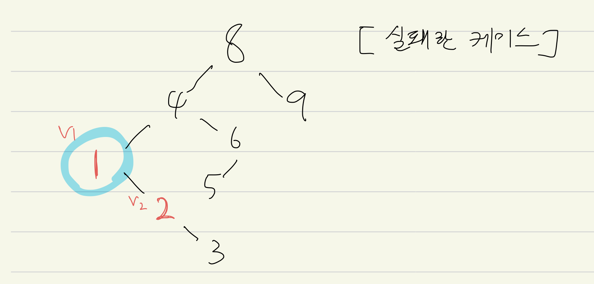

# 1. Binary Search Tree


```python
%reset
```

    Once deleted, variables cannot be recovered. Proceed (y/[n])? y


```python
%whos
```

    Interactive namespace is empty.


```python
class Node:
    def __init__(self,value):
        self.value = value
        self.left = None
        self.right = None
```


```python
class BST:
    
    inserted_value = []
    
    def __init__(self,head):
        self.head = head
        
    def search(self,search_value):
        searched = []
        searched.append(False)
        self.current_node = self.head
        self.parend_node = self.head
        
        # 순회하며 탐색
        while True:
            if self.current_node.value == search_value:
                searched[0] = True
                searched.append(self.current_node)
                searched.append(self.parent_node)
                return searched
            
            elif self.current_node.value > search_value:
                if self.current_node.left != None:
                    self.current_node = self.current_node.left
                    self.parent_node = self.current_node
                else:
                    searched[0] = False
                    return searched
                
            else:
                if self.current_node.right != None:
                    self.current_node = self.current_node.right
                    self.parent_node = self.current_node
                else:
                    searched[0] = False
                    return searched
                
    def insert(self,insert_value):
        self.current_node = self.head
        
        while self.current_node:
            if self.current_node.value == insert_value:
                print(self.current_node.value)
                return "같은 값이 트리 안에 있습니다."

            elif self.current_node.value > insert_value:
                if self.current_node.left == None:
                    self.current_node.left = Node(insert_value)
                    self.inserted_value.append(insert_value)
                    return "입력완료"
                else:
                    self.current_node = self.current_node.left

            else:
                if self.current_node.right == None:
                    self.current_node.right = Node(insert_value)
                    self.inserted_value.append(insert_value)
                    return "입력완료"
                else:
                    self.current_node = self.current_node.right
        
    def delete(self,delete_value):
        search_result = []
        search_result = self.search(delete_value)
        
        if search_result[0] == True:
            self.current_node = search_result[1]
            self.parent_node = search_result[2]
        else:
            return "삭제할 값이 트리 안에 존재하지 않습니다."
        
        if self.current_node.left == None and self.current_node.right == None:
            self.current_node = None
            
        elif self.current_node.left != None and self.current_node.right == None:
            if self.currnet_node.value < self.parent_node.value:
                self.parent_node.left = self.current_node.left
                self.current_node = None
            else:
                self.parent_node.left = self.current_node.right
                self.current_node = None
                
        elif self.current_node.left == None and self.current_node.right != None:
            if self.current_node.value < self.parent_node.value:
                self.parent_node.right = self.current_node.left
                self.current_node = None
            else:
                self.parent_node.right = self.current_node.right
                self.current_node = None
        
        else:
            change_node = self.current_node.right
            change_parent_node = self.current_node.right
            
            if self.current_node.value < self.parent_node.value:
                # 최좌측 node까지 타고 내려감
                while change_node.left:
                    change_parent_node = change_node
                    change_node.left = change_node
                    # 최좌측 node(change_node)의 child가 존재 X / 존재 O
                    if change_node.right == None:
                        self.parent_node.left = change_node
                        change_node.left = self.current_node.left
                        change_node.right = self.current_node.right
                    else:
                        change_parent_node.left = change_node.right
                        self.parent_node.left = change_node
                        change_node.left = self.current_node.left
                        change_node.right = self.current_node.right
            
            else:
                while change_node.left:
                    change_parent_node = change_node
                    change_node.left = change_node
                    # 최좌측 node(change_node)의 child가 존재 X / 존재 O
                    if change_node.right == None:
                        self.parent_node.right = change_node
                        change_node.left = self.current_node.left
                        change_node.right = self.current_node.right
                    else:
                        change_parent_node.left = change_node.right
                        self.parent_node.right = change_node
                        change_node.left = self.current_node.left
                        change_node.right = self.current_node.right
        
```


```python
# head = Node(1)
# BST = BST(head)
# BST.insert(2)
# BST.insert(3)
# BST.insert(0)
# BST.insert(4)
# BST.insert(8)
```


```python
# BST.inserted_value = sorted(BST.inserted_value,key = lambda x:x)
```


```python
# BST.inserted_value
```

# 2. BST evaluation


```python
# 0 ~ 999 숫자 중에서 임의로 100개를 추출해서, 이진 탐색 트리에 입력, 검색, 삭제
import random

# 0 ~ 999 중, 100 개의 숫자 랜덤 선택o
bst_nums = set()
while len(bst_nums) != 100:
    bst_nums.add(random.randint(0, 999))
# print (bst_nums)

# 선택된 100개의 숫자를 이진 탐색 트리에 입력, 임의로 루트노드는 500을 넣기로 함
head = Node(500)
binary_tree = BST(head)
for num in bst_nums:
    binary_tree.insert(num)
    
# 입력한 100개의 숫자 검색 (검색 기능 확인)
for num in bst_nums:
    if binary_tree.search(num) == False:
        print ('search failed', num)

# 입력한 100개의 숫자 중 10개의 숫자를 랜덤 선택
delete_nums = set()
bst_nums = list(bst_nums)
while len(delete_nums) != 10:
    delete_nums.add(bst_nums[random.randint(0, 99)])

# 선택한 10개의 숫자를 삭제 (삭제 기능 확인)
for del_num in delete_nums:
    if binary_tree.delete(del_num) == False:
        print('delete failed', del_num)
```

# 3. Binary Search Tree : Lowest Common Ancestor

- [Hacker rank 문제](hackerrank.com/challenges/binary-search-tree-lowest-common-ancestor/problem)

### 1차 submit

- 1 test case 실패

```
[input]
8
8 4 9 1 2 3 6 5
1 2

[expected output]
1

[output]
4
```


```python
from IPython.display import Image
Image('/Users/kimjeongseob/Desktop/딥러닝_프로그래밍/0827/알고리즘/LCA_faliure_case.jpeg')
```





```python
class Node:
    def __init__(self, info):
        self.info = info
        self.left = None
        self.right = None
        self.level = None

    def __str__(self):
        return str(self.info)

class BinarySearchTree:
    def __init__(self):
        self.root = None

    def create(self, val):
        if self.root == None:
            self.root = Node(val)
        else:
            current = self.root

            while True:
                if val < current.info:
                    if current.left:
                        current = current.left
                    else:
                        current.left = Node(val)
                        break
                elif val > current.info:
                    if current.right:
                        current = current.right
                    else:
                        current.right = Node(val)
                        break
                else:
                    break


def lca(root, v1, v2):
    current_node = root
    parent_node = root
    v1_parent_list = []
    v2_parent_list = []

    while True:
        if current_node.info == v1:
            if root == current_node:
                v1_parent_list.append(parent_node)
                break
            else:       
                break

        elif current_node.info > v1:
            if current_node.left != None:
                current_node = current_node.left
                v1_parent_list.append(parent_node)
                parent_node = current_node
            else:
                break
        else:
            if current_node.right != None:
                current_node = current_node.right
                v1_parent_list.append(parent_node)
                parent_node = current_node
            else:
                break
                
    current_node = root
    parent_node = root
    
    while True:
        if current_node .info == v2:
            if root == current_node:
                v2_parent_list.append(parent_node)
                break
            else:       
                break
            
        elif current_node.info > v2:
            if current_node.left != None:
                current_node = current_node.left
                v2_parent_list.append(parent_node)
                parent_node = current_node
            else:
                break
        else:
            if current_node.right != None:
                current_node = current_node.right
                v2_parent_list.append(parent_node)
                parent_node = current_node
            else:
                break

    if len(v1_parent_list) <= len(v2_parent_list):
        loop = len(v1_parent_list)
        for i in range(loop):
            if v1_parent_list[:loop][-(i+1)] == v2_parent_list[:loop][-(i+1)]:
                return v1_parent_list[:loop][-(i+1)]

    else:
        loop = len(v2_parent_list)
        for i in range(loop):
            if v2_parent_list[:loop][-(i+1)] == v1_parent_list[:loop][-(i+1)]:
                return v2_parent_list[:loop][-(i+1)]


tree = BinarySearchTree()
t = int(input())

arr = list(map(int, input().split()))

for i in range(t):
    tree.create(arr[i])

v = list(map(int, input().split()))

ans = lca(tree.root, v[0], v[1])
print (ans.info)
```

    8
    8 4 9 1 2 3 6 5
    1 2
    1


### 2차 submit

- 성공

- 1차 submit의 47-51, 72-77 line 수정


```python
class Node:
    def __init__(self, info):
        self.info = info
        self.left = None
        self.right = None
        self.level = None

    def __str__(self):
        return str(self.info)

class BinarySearchTree:
    def __init__(self):
        self.root = None

    def create(self, val):
        if self.root == None:
            self.root = Node(val)
        else:
            current = self.root

            while True:
                if val < current.info:
                    if current.left:
                        current = current.left
                    else:
                        current.left = Node(val)
                        break
                elif val > current.info:
                    if current.right:
                        current = current.right
                    else:
                        current.right = Node(val)
                        break
                else:
                    break


def lca(root, v1, v2):
    current_node = root
    parent_node = root
    v1_parent_list = []
    v2_parent_list = []

    while True:
        if current_node.info == v1:
            v1_parent_list.append(parent_node)
            break

        elif current_node.info > v1:
            if current_node.left != None:
                current_node = current_node.left
                v1_parent_list.append(parent_node)
                parent_node = current_node
            else:
                break
        else:
            if current_node.right != None:
                current_node = current_node.right
                v1_parent_list.append(parent_node)
                parent_node = current_node
            else:
                break
                
    current_node = root
    parent_node = root
    
    while True:
        if current_node.info == v2:
            v2_parent_list.append(parent_node)
            break
            
        elif current_node.info > v2:
            if current_node.left != None:
                current_node = current_node.left
                v2_parent_list.append(parent_node)
                parent_node = current_node
            else:
                break
        else:
            if current_node.right != None:
                current_node = current_node.right
                v2_parent_list.append(parent_node)
                parent_node = current_node
            else:
                break

    if len(v1_parent_list) <= len(v2_parent_list):
        loop = len(v1_parent_list)
        for i in range(loop):
            if v1_parent_list[:loop][-(i+1)] == v2_parent_list[:loop][-(i+1)]:
                return v1_parent_list[:loop][-(i+1)]

    else:
        loop = len(v2_parent_list)
        for i in range(loop):
            if v2_parent_list[:loop][-(i+1)] == v1_parent_list[:loop][-(i+1)]:
                return v2_parent_list[:loop][-(i+1)]


tree = BinarySearchTree()
t = int(input())

arr = list(map(int, input().split()))

for i in range(t):
    tree.create(arr[i])

v = list(map(int, input().split()))

ans = lca(tree.root, v[0], v[1])
print (ans.info)
```

    8
    8 4 9 1 2 3 6 5
    1 2
    1

